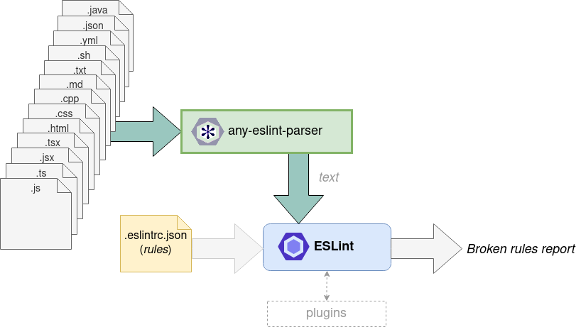

<p align="center">
  <a href="https://any-eslint-parser.io/"></a>
</p>

<h1 align="center">Check Any file with ESLint</h1>

[](https://any-eslint-parser.github.io/)
[](https://www.npmjs.com/package/any-eslint-parser)
[](https://www.npmjs.com/package/any-eslint-parser)
[](LICENSE.txt)
[](https://github.com/gmullerb/any-eslint-parser)
[](https://gitlab.com/gmullerb/any-eslint-parser)
__________________

## Quick Start

1 . Add dependencies:

`package.json`:

```json
  ..
  "devDependencies": {
    "any-eslint-parser": "1.0.0",
    "eslint": "*",
    ..
```

2 . Configure eslint with the required rules, e.g. `eol-last` and `no-tabs`:

`.eslintrc-any.json`:

```json
{
  "parser": "any-eslint-parser",
  "rules": {
    "eol-last": "error",
    "no-tabs": "error"
  }
}
```

> Any eslint rule that not required AST can be used, this example uses `eol-last` and `no-tabs`.

3 . Configure linting script:

`package.json`:

```json
  "scripts": {
    "lint.any": "eslint --config .eslintrc-any.json \"**/*.+(js|jsx|ts|tsx|json|yml|xml|sh|txt|md|svg|properties|gradle|java|cpp|c|html|css|groovy|gitignore|npmignore)\"",
    ..
  }
```

__________________

## Goals

`any-eslint-parser` provides a parser so "any" type of file can be checked by [eslint](https://eslint.org). Although eslint claims to be AST-based, there are rules that does not based on AST, rather they are based on the **text content** of the file, e.g. [`eol-last`](https://eslint.org/docs/rules/eol-last), [`no-tabs`](https://eslint.org/docs/rules/no-tabs), [`eslint-plugin-regex`](https://eslint-plugin-regex.github.io), etc.
`any-eslint-parser` can be used to check json files, yaml files, script files, source code files in any programming language (e.g. java, c++, groovy, etc.), svg files, markdown files, etc.



> This idea arise from the need to use [`eslint-plugin-regex`](https://eslint-plugin-regex.github.io) in other type of files, besides javascript. (Then saw on this as a more versatile and configurable way to check common files than using lintspaces)

* Rules that required AST will simply be ignored, i.e. no error will be reported.
  * Neither the [list of eslint rules](https://eslint.org/docs/rules/), nor rules description provide explicit information on whether they need AST or not, so, You may need to test the rules before using, or use regex rules aka [`eslint-plugin-regex`](https://eslint-plugin-regex.github.io).
* Cascading and Hierarchy of ESlint Configuration files are still applied.
  * Remember if `eslintrc-any.json` or any parent have rules that require AST, those will be ignored when using `any-eslint-parser`.
  * You may want to use an independent `.eslintrc.json` file when using `any-eslint-parser` (take a look at [Migrating to eslint/any-eslint-parser from lintspaces](https://any-eslint-parser.github.io/docs/migration.html) as detailed example).
    * Using [`--no-eslintrc`](https://eslint.org/docs/user-guide/command-line-interface#-no-eslintrc) option can be very helpful since will ignore all configuration files, i.e `.eslintrc.*` and `package.json`, only taking in account the one set with [`--config`](https://eslint.org/docs/user-guide/command-line-interface#-c-config) option.
    * May want to ignore some folders or files using [`--ignore-pattern`](https://eslint.org/docs/user-guide/command-line-interface#-ignore-pattern) or [`--ignore-path`](https://eslint.org/docs/user-guide/command-line-interface#-ignore-path).
    * All these options [`--no-eslintrc`](https://eslint.org/docs/user-guide/command-line-interface#-no-eslintrc), [`--ignore-pattern`](https://eslint.org/docs/user-guide/command-line-interface#-ignore-pattern) and [`--ignore-path`](https://eslint.org/docs/user-guide/command-line-interface#-ignore-path) are very useful when other parser are used in the project in order to avoid conflicts.

## Examples

### Replacing lintspaces

`.eslintrc-any.json`

```json
  {
    "parser": "any-eslint-parser",
    "rules": {
      "eol-last": "error",
      "no-tabs": "error"
    }
  }
```

`package.json`:

```json
  "scripts": {
    "lint.any": "eslint --config .eslintrc-any.json \"**/[\\.a-zA-Z]*.+(js|jsx|ts|tsx|json|yml|xml|sh|txt|md|svg|properties|gradle|java|cpp|c|html|css|groovy)\" \"**/.+(|gitignore|npmignore)\" --no-eslintrc --ignore-pattern \"build\"",
    ..
  },
  "devDependencies": {
    "any-eslint-parser": "1.0.0",
    "eslint": "*",
    ..
  }
```

More detail at [Migrating to eslint/any-eslint-parser from lintspaces](https://any-eslint-parser.github.io/docs/migration.html).

### Using [`eslint-plugin-regex`](https://eslint-plugin-regex.github.io)

Requiring `Copyright` and `License` on every source file of a project.

`.eslintrc-any.json`

```json
  {
    "parser": "any-eslint-parser",
    "rules": {
      "regex/required": [
        "error", [
          "^(?:(?:\\/\\/)|#) Copyright \\(c\\) Super Team",
          "^(?:(?:\\/\\/)|#) Licensed under the MIT License \\(MIT\\), see LICENSE.txt"
        ]
      ]
    }
  }
```

`package.json`:

```json
  "scripts": {
    "lint.any": "eslint --config .eslintrc-any.json \"**/*.+(js|jsx|ts|tsx|gradle|java|cpp|c|groovy|yml|sh)\"",
    ..
  },
  "devDependencies": {
    "any-eslint-parser": "1.0.0",
    "eslint": "*",
    "eslint-plugin-regex": "*",
    ..
  }
```

More regex rules examples at [`eslint-plugin-regex`](https://eslint-plugin-regex.github.io) and [`eslint-plugin-base-style-config`](https://github.com/gmullerb/base-style-config/tree/HEAD/js/config/configs/regex) regex rules.

__________________

## Prerequisites

* [`"eslint": "*"`](https://www.npmjs.com/package/eslint).

__________________

## Contributing

* **Use it**.
* **Share it**.
* [Give it a Star](https://github.com/gmullerb/eslint-plugin-regex).
* [Propose changes or improvements](https://github.com/gmullerb/eslint-plugin-regex/issues).
* [Report bugs](https://github.com/gmullerb/eslint-plugin-regex/issues).

## License

[MIT License](LICENSE.txt)
__________________

## Remember

* Use code style verification tools => Encourages Best Practices, Efficiency, Readability and Learnability.
* Code Review everything => Encourages Functional suitability, Performance Efficiency and Teamwork.
* If viable, Start testing early => Encourages Reliability and Maintainability.

## Additional words

Don't forget:

* **Love what you do**.
* **Learn everyday**.
* **Learn yourself**.
* **Share your knowledge**.
* **Think different!**.
* **Learn from the past, dream on the future, live and enjoy the present to the max!**.
* **Enjoy and Value the Quest** (It's where you learn and grow).

At life:

* Let's act, not complain.
* Be flexible.

At work:

* Let's give solutions, not questions.
* Aim to simplicity not intellectualism.
